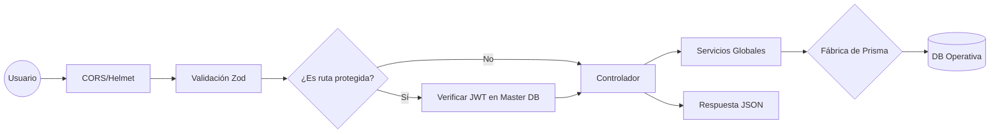

# Arquitectura y Flujo de Peticiones - SICIC-INSAI V2.0

Este documento detalla cómo viaja la información a través del backend, desde que llega del frontend hasta que se consulta la base de datos operativa.

---

## Ciclo de Vida de una Petición (Request Flow)

Cuando el servidor recibe una solicitud (por ejemplo, `POST /api/auth/login`), sigue este orden estricto de capas:

### 1. Capa de Red y Seguridad (Express + Middleware Global)

- **Helmet:** Protege contra vulnerabilidades comunes de HTTP.
- **CORS Modular:** Verifica que el origen (frontend) esté en la lista blanca del `.env`.
- **JSON Parser:** Traduce el cuerpo de la petición a un objeto JavaScript.

### 2. Capa de Validación (Zod)

Antes de procesar cualquier dato, el middleware de validación compara los datos recibidos con el esquema definido en `src/schemas/`.

- _Si falla:_ Se detiene la petición y se devuelve un `400 Bad Request`.
- _Si pasa:_ La petición continúa al controlador.

### 3. Capa de Autenticación (JWT + Master DB)

Si la ruta es protegida, el middleware `auth.middleware.js` entra en acción:

1.  Extrae el token del header `Authorization`.
2.  Valida la firma y expiración (8 horas).
3.  Verifica en la **Base de Datos Master** que el usuario siga activo.

### 4. Capa de Lógica de Negocio (Controllers)

El controlador decide qué hacer:

- Si la acción es sobre una instancia específica (ej. "Crear Inspección"), usa la **Fábrica de Prisma** para abrir la conexión a la base de datos operativa correspondiente (`req.db`).

### 5. Capa de Servicios Transversales (Servicios Globales)

Para mantener la arquitectura limpia, los controladores delegan tareas complejas a los servicios:

- **StorageService:** Gestión de archivos (Local/R2) y conversión WebP.
- **ExcelService:** Generación de reportes institucionales.
- **BitacoraService:** Registro automático de auditoría.

---

## Diagrama de Flujo Visual (Mermaid)

---

## Gestión de Errores Global

Cualquier fallo (base de datos caída, error de servidor, validación fallida) es capturado por el `errorHandler` centralizado, asegurando que la API nunca "muera" y siempre responda con un formato estándar.

---

[Volver al índice de documentación](../WIKI.md)

**Documentación Técnica Funcional**
**SICIC-INSAI V2.0**
