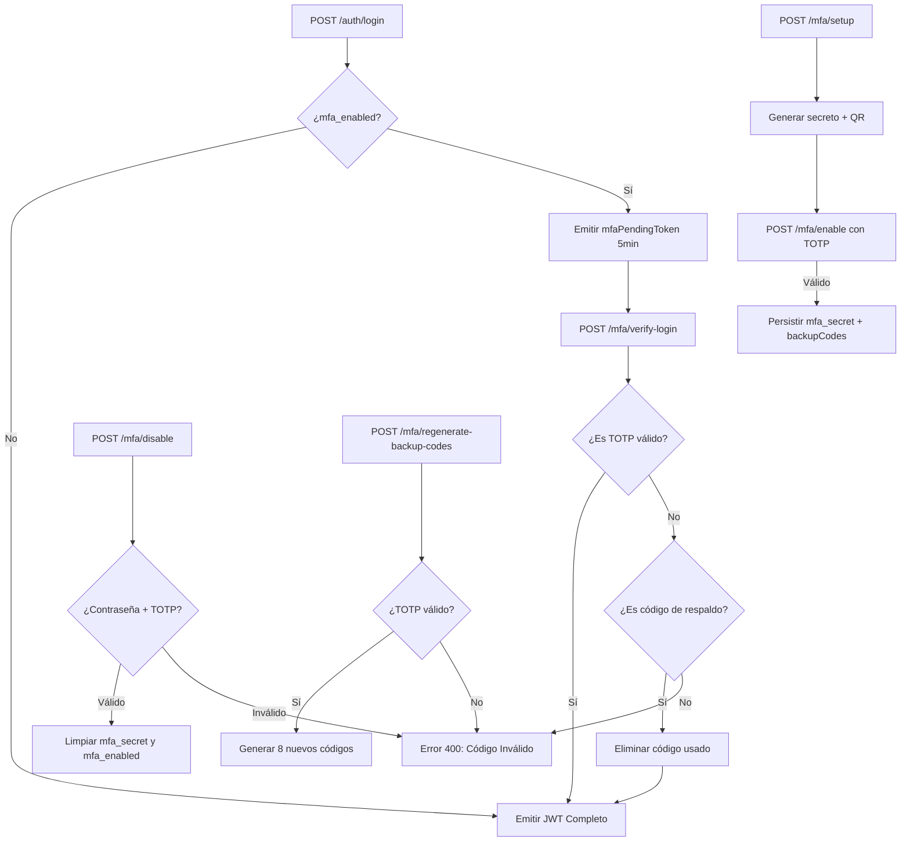

# Autenticación de Dos Factores (MFA/TOTP) — Backend

Este documento describe la arquitectura e implementación del sistema de Autenticación de Dos Factores (MFA) basado en TOTP para el SICIC-INSAI V2.0, incluyendo la gestión de códigos de respaldo y los flujos de activación, verificación y desactivación.

---

## 1. Dependencias y Utilidad Principal (`mfa.util.js`)

La lógica central de generación y verificación TOTP se encapsula en `src/utils/mfa.util.js`. Utiliza la librería `otplib` v13 con los plugins `NobleCryptoPlugin` y `ScureBase32Plugin` para compatibilidad con entornos ESM de Node.js.

### Funciones Exportadas

| Función | Descripción |
|---|---|
| `generateMfaSecret(username)` | Genera un secreto TOTP, la URL `otpauth://` y un QR en formato Data URL Base64 de 256×256px. |
| `verifyMfaToken(token, secret)` | Verifica un código TOTP de 6 dígitos contra el secreto del usuario, con tolerancia de `±1` ventana de 30s. |
| `generateBackupCodes(count)` | Genera `count` (por defecto 8) códigos de respaldo únicos en formato `XXXX-XXXX` usando `crypto.randomBytes`. |

---

## 2. Campos en la Base de Datos Master

El esquema `usuarios` en la base de datos Master almacena los siguientes campos relacionados con MFA:

| Campo | Tipo | Descripción |
|---|---|---|
| `mfa_enabled` | `Boolean` | Indicador de si el MFA está activo para la cuenta. |
| `mfa_secret` | `String \| null` | Secreto TOTP generado por `otplib` y almacenado de forma segura. |
| `mfa_backup_codes` | `Json` (array) | Lista de 8 códigos de respaldo de un solo uso en formato `XXXX-XXXX`. |

---

## 3. Endpoints del API (`/api/auth/mfa/...`)

### 3.1. Flujo de Activación (3 Pasos)

```
POST /api/auth/mfa/setup      → Genera secreto y QR (privado)
POST /api/auth/mfa/enable     → Valida primer TOTP y activa MFA (privado)
```

- **`/mfa/setup`**: Genera un secreto temporal y retorna el `qrCodeUrl` y el `secret` en texto plano para que el usuario lo escanee o registre manualmente en su app autenticadora. No persiste nada aún.
- **`/mfa/enable`**: Recibe el `secret` y el primer `token` TOTP de 6 dígitos para verificar que la app esté correctamente vinculada. Si es válido: persiste `mfa_secret`, activa `mfa_enabled = true` y genera y retorna los **8 códigos de respaldo**.

### 3.2. Verificación en Login

```
POST /api/auth/mfa/verify-login   → Acepta código TOTP o código de respaldo (público con mfaPendingToken)
```

El flujo de login con MFA activo es de **dos pasos**:
1. `POST /api/auth/login` detecta `mfa_enabled = true` y retorna un **`mfaPendingToken`** (JWT de corta duración, 5 minutos) en lugar del token de sesión completo.
2. El cliente envía el `mfaPendingToken` junto con el `code` (TOTP de 6 dígitos o código de respaldo) al endpoint `/mfa/verify-login`. Si es válido, se emite el token de sesión completo.
- **Uso de código de respaldo**: Se elimina automáticamente del array `mfa_backup_codes` del usuario después de un uso exitoso.

### 3.3. Desactivación

```
POST /api/auth/mfa/disable    → Requiere contraseña actual + código TOTP (privado)
```

Para desactivar, se exige confirmación con la **contraseña actual** del usuario y un **código TOTP válido** (o de respaldo). Al desactivar, `mfa_secret`, `mfa_enabled` y `mfa_backup_codes` se limpian.

### 3.4. Regeneración de Códigos de Respaldo

```
POST /api/auth/mfa/regenerate-backup-codes   → Requiere código TOTP actual (privado)
```

Genera 8 nuevos códigos de respaldo, **invalidando todos los anteriores**. Requiere un código TOTP válido como factor de confirmación. El evento queda registrado en la bitácora como `MFA_BACKUP_CODES_REGENERADOS`.

---

## 4. Eventos de Bitácora

Cada acción MFA genera un registro auditado:

| Acción | Evento en Bitácora |
|---|---|
| Login con TOTP | `INICIO_SESION_MFA` |
| Login con código de respaldo | `INICIO_SESION_MFA_BACKUP` |
| Activar MFA | `MFA_HABILITADO` |
| Desactivar MFA | `MFA_DESHABILITADO` |
| Regenerar códigos de respaldo | `MFA_BACKUP_CODES_REGENERADOS` |

---

## 5. Diagrama de Flujo MFA Completo



---

[Volver al índice de documentación](../WIKI.md)

**Seguridad MFA — SICIC-INSAI V2.0**
