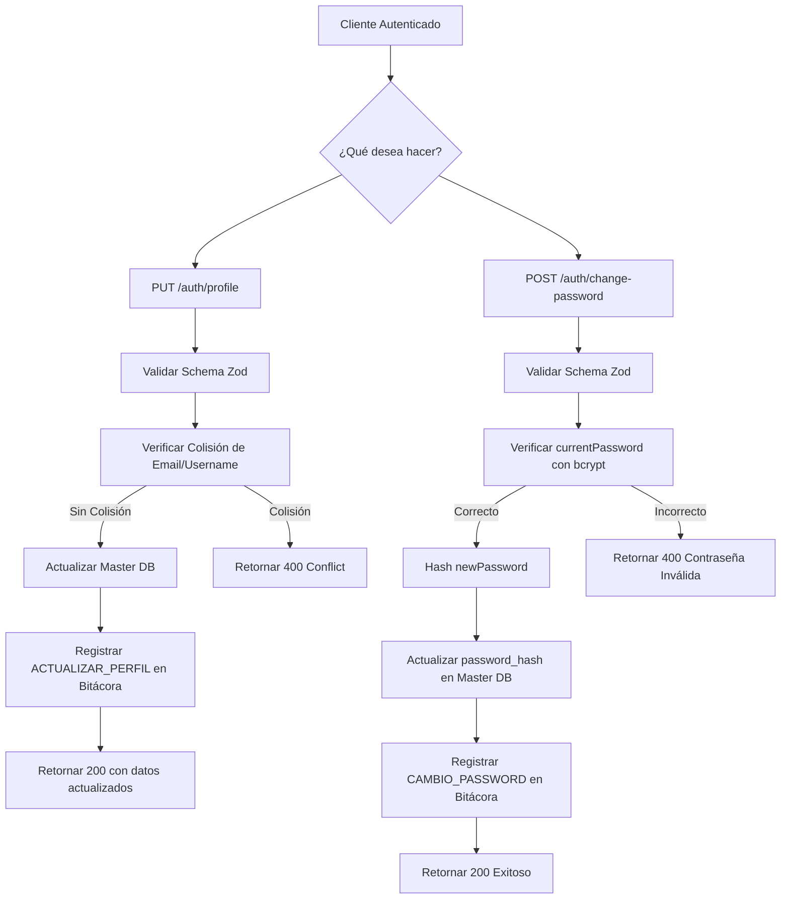

# Gestión de Perfil de Usuario — Backend

Este documento describe los endpoints y la lógica de negocio para que un usuario autenticado pueda gestionar su propio perfil: actualizar sus datos de identificación y cambiar su contraseña de forma segura.

---

## 1. Resumen de Endpoints

Ambos endpoints pertenecen al `auth.controller.js` y son accesibles bajo la ruta `/api/auth/`.

| Método | Ruta | Acción | Acceso |
|---|---|---|---|
| `PUT` | `/api/auth/profile` | Actualizar username y email | Privado (JWT) |
| `POST` | `/api/auth/change-password` | Cambiar contraseña propia | Privado (JWT) |

---

## 2. Actualización de Datos de Perfil (`updateMyProfile`)

### Validación (`updateProfileSchema`)
El esquema Zod verifica que:
- `username`: Cadena de mínimo 3 caracteres, obligatorio.
- `email`: Email con formato válido, obligatorio.

### Lógica del Controlador
1. **Busca al usuario** en la Master DB por `req.user.id` (extraído del JWT).
2. **Verifica unicidad**: Realiza una búsqueda de colisión para asegurarse de que el nuevo `email` o `username` no pertenezca ya a otro usuario (`id: { not: userId }`). Si hay colisión, retorna `400 Conflict`.
3. **Actualiza** los campos `username`, `email` y `updated_at` en la Master DB.
4. **Audita** la operación en la bitácora con acción `ACTUALIZAR_PERFIL`, incluyendo los nuevos valores en `payload_nuevo`.

### Respuesta exitosa
```json
{
  "status": "success",
  "message": "Perfil actualizado exitosamente",
  "data": {
    "id": 1,
    "username": "nuevo_usuario",
    "email": "nuevo@insai.gob.ve",
    "status": true,
    "created_at": "...",
    "updated_at": "..."
  }
}
```

---

## 3. Cambio de Contraseña (`changeMyPassword`)

### Validación (`changePasswordSchema`)
El esquema Zod verifica que:
- `currentPassword`: Obligatorio.
- `newPassword`: Mínimo 6 caracteres, obligatorio.
- `confirmPassword`: Debe coincidir con `newPassword` (validación `.refine()`).

### Lógica del Controlador
1. **Busca al usuario** en la Master DB.
2. **Compara la contraseña actual** con `bcrypt.compare` para verificar la identidad del solicitante antes de hacer cualquier cambio.
3. **Genera el hash** de la nueva contraseña con `bcrypt.hash(newPassword, 10)`.
4. **Actualiza** `password_hash` y `updated_at` en la Master DB.
5. **Audita** la operación con acción `CAMBIO_PASSWORD`.

> **Nota de Seguridad:** El cambio de contraseña **no invalida el token JWT** actual. En ambientes de alta seguridad, se podría complementar con un `logout` forzoso, pero se dejó como decisión del administrador del sistema.

---

## 4. Diagrama de Flujo



---

[Volver al índice de documentación](../WIKI.md)

**Gestión de Perfil de Usuario — SICIC-INSAI V2.0**
