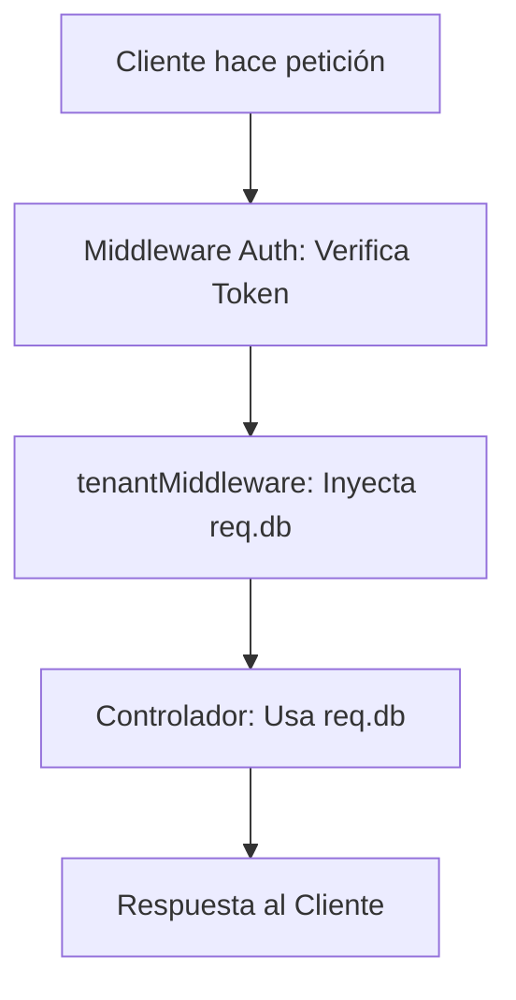

# Arquitectura de Multi-Tenancia con Middleware

Este documento explica el funcionamiento del sistema de multi-tenancia (multi-tenant) implementado en el backend, detallando la refactorización realizada para centralizar las conexiones a bases de datos dinámicas.

## 1. Concepto General
El sistema SICIC-INSAI maneja múltiples instancias operativas (bases de datos independientes por inquilino). Para evitar código repetitivo en los controladores, se utiliza un **Middleware de Express** que identifica automáticamente la base de datos correcta y la inyecta en la petición.

## 2. Componentes Arquitectónicos

### A. La Utilidad: `src/utils/dbConex.js`
Es la encargada de la lógica pura. Su función `getTenantPrismaFromRequest(req)` realiza lo siguiente:
1. Extrae el `db_name` de la sesión del usuario (`req.user.currentInstance`).
2. Valida que exista una instancia seleccionada.
3. Solicita al gestor de Prisma la conexión correspondiente.

### B. El Middleware: `src/middlewares/tenant.middleware.js`
Actúa como un puente entre la utilidad y los controladores. 
- **Acción:** Llama a la utilidad y asigna el resultado a la propiedad `req.db`.
- **Flujo:** Permite que la conexión esté disponible de forma global en toda la cadena de la petición.

## 3. Ciclo de Vida de una Petición



Cuando una petición llega a una ruta protegida:
1. El objeto `req` entra al `tenantMiddleware`.
2. Se le añade la propiedad `.db` (contiene la instancia de Prisma del tenant).
3. El controlador simplemente accede a `req.db` sin preocuparse por cómo se conectó o a qué base de datos pertenece.

## 4. Cómo usar en nuevos módulos

### En las Rutas (`src/routes/`)
Para que un módulo tenga acceso automático a la base de datos del tenant, debes inyectar el middleware en el router:

```javascript
import { tenantMiddleware } from '../middlewares/tenant.middleware.js';

const router = Router();
router.use(protect); // Primero autenticar
router.use(tenantMiddleware); // Luego inyectar la DB
```

### En el Controlador (`src/controllers/`)
Ya no es necesario importar ninguna utilidad de conexión. La conexión ya viene "dentro" del objeto `req`:

```javascript
export const getDatos = async (req, res) => {
    const tenantPrisma = req.db; // Ya inyectado por el middleware
    const data = await tenantPrisma.miTabla.findMany();
    res.json(data);
};
```

## 5. Beneficios de esta Refactorización

1. **Código DRY (Don't Repeat Yourself):** Se eliminó la repetición de lógica de conexión en más de 20 funciones de controladores.
2. **Separación de Responsabilidades:** Los controladores ahora solo se encargan de la lógica de negocio, no de gestionar conexiones.
3. **Manejo Centralizado de Errores:** Si un usuario no tiene una instancia seleccionada, el middleware corta la ejecución y lanza un error capturado por el `errorHandler` global.
4. **Mantenibilidad:** Si mañana cambia la forma de obtener el nombre de la base de datos, solo se debe modificar un archivo (`dbConex.js`).

_Arquitectura de Backend - SICIC-INSAI V2.0_