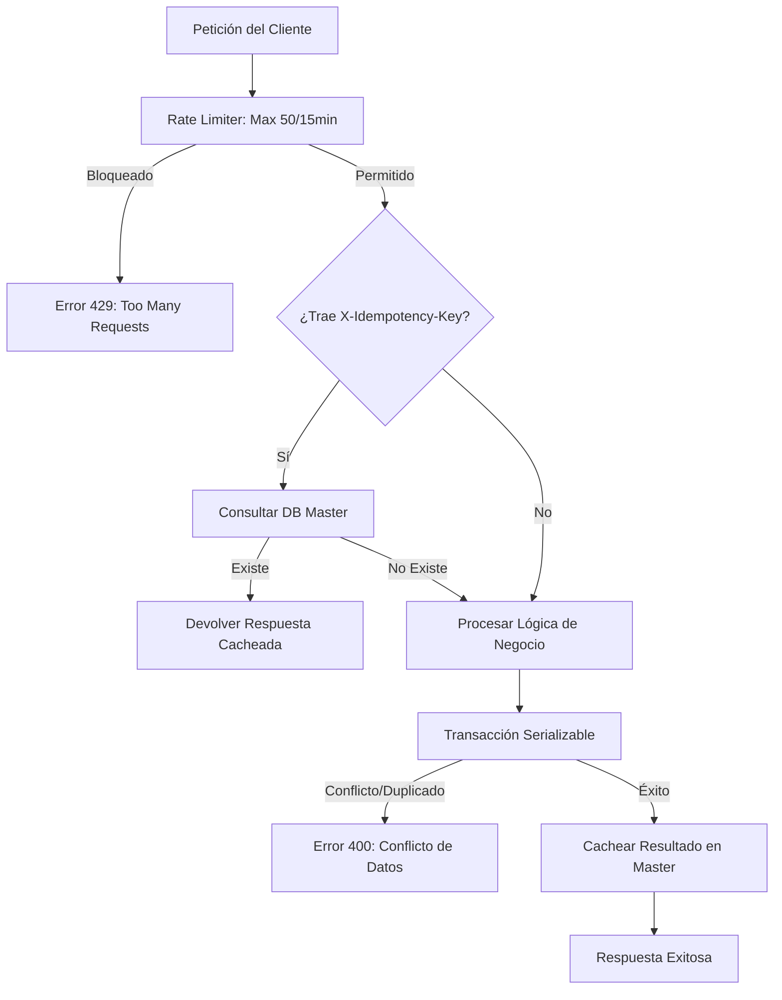

# Seguridad y Robustez de la API: Idempotencia y Rate Limiting

Este documento detalla los mecanismos implementados para garantizar la integridad de los datos, evitar la duplicidad de registros y proteger la API contra abusos o ataques de denegación de servicio (DoS).

---

## 1. Idempotencia (`X-Idempotency-Key`)

La idempotencia garantiza que realizar la misma operación varias veces tenga el mismo efecto que realizarla una sola vez. Esto es crítico en procesos operativos donde un re-intento por error de red podría duplicar un registro.

### Mecanismo Técnico
- **Header:** `X-Idempotency-Key` (UUID generado por el cliente).
- **Middleware:** `idempotency.middleware.js` intercepta todas las peticiones POST, PUT y DELETE.
- **Persistencia:** Las llaves y sus respuestas se almacenan en la **Base de Datos Master** (tabla `idempotency_keys`).
- **Flujo:**
  1. El middleware busca la llave en la DB Master.
  2. Si existe, devuelve la respuesta cacheada inmediatamente.
  3. Si no existe, procesa la petición y guarda el resultado (status y body) antes de responder al cliente.

---

## 2. Rate Limiting Operativo (`writeLimiter`)

Para proteger los endpoints críticos de escritura, se ha implementado un limitador de tasa agresivo que evita que un usuario o proceso automatizado sature el sistema.

### Configuración
- **Alcance:** Todas las rutas bajo `/api` que no sean GET (exceptuando `/auth` que tiene su propio limitador).
- **Límite:** 50 solicitudes por cada 15 minutos.
- **Identificación:** Se basa en el ID del usuario autenticado (prioritario) o en la dirección IP.

---

## 3. Transacciones Serializables y Concurrencia

En los módulos críticos (**Solicitudes, Planificaciones, Inspecciones, Acta de Silos**), se utiliza el nivel de aislamiento de base de datos más estricto.

### Implementación
- **Serializable Isolation:** Evita fenómenos de "Phantoms" o lecturas sucias. Si dos usuarios intentan modificar exactamente el mismo rango de datos, la base de datos obliga a que uno ocurra después del otro.
- **Validación Atómica:** Dentro de la transacción se verifica la existencia de duplicados (por código o relación de negocio).
- **Estado Sincronizado:** Garantiza que si la creación de un registro falla, cualquier cambio colateral (como el cambio de estatus de una solicitud) se revierta automáticamente (Atomicidad).

---

## Diagrama de Seguridad Operativa

---

[Volver al índice de documentación](../WIKI.md)

**Seguridad y Robustez de Datos**
**SICIC-INSAI V2.0**
