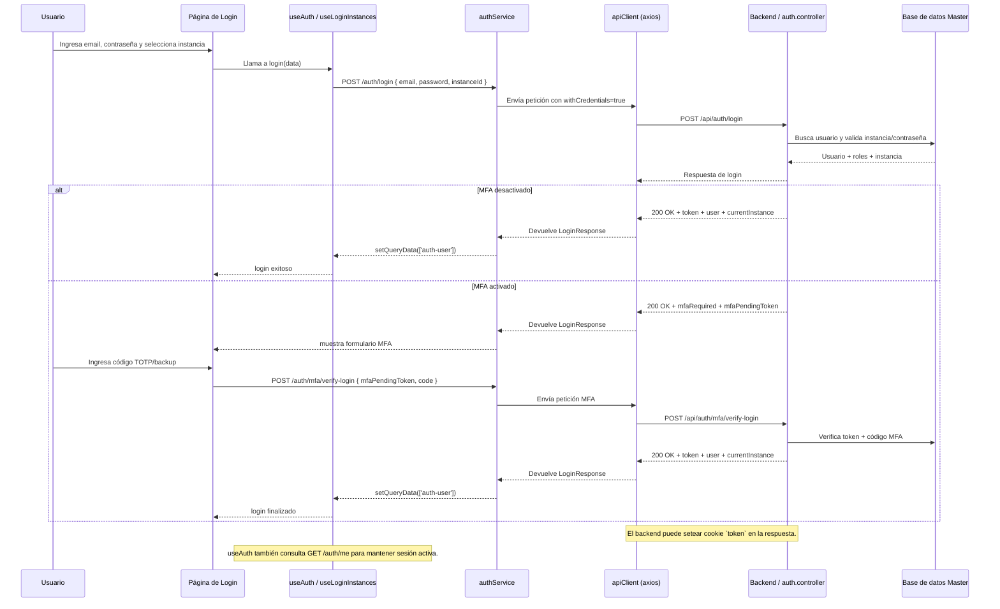

# Diagrama de login del frontend SICIC-INSAI V2.0

## 1. Flujo general de peticiones de login

## 2. Detalle de las peticiones del frontend

### 2.1 Carga de instancias
- Endpoint: `GET /auth/instances?email={email}`
- Cuándo ocurre: cuando el usuario escribe su correo en el formulario.
- Propósito: obtener las instancias/estados disponibles para ese usuario.
- Resultado: lista de instancias mostrada en el selector de estado.

### 2.2 Solicitud de login principal
- Endpoint: `POST /auth/login`
- Datos enviados:
  - `email`
  - `password`
  - `instanceId`
- Qué hace el frontend:
  - `useAuth().login(data)`
  - `authService.login` usa `apiClient.post('/auth/login', credentials)`
- Qué espera el backend:
  - validar usuario activo
  - verificar que el usuario tiene acceso a la instancia seleccionada
  - comprobar la contraseña
  - detectar sesión activa previa
- Resultado posible:
  - login exitoso inmediato
  - MFA requerido con `mfaPendingToken`

### 2.3 Verificación MFA (si aplica)
- Endpoint: `POST /auth/mfa/verify-login`
- Datos enviados:
  - `mfaPendingToken`
  - `code`
- Qué hace el frontend:
  - formulario de segundo factor en `Login.tsx`
  - `useVerifyMfaLogin().mutate({ mfaPendingToken, code })`
- Qué espera el backend:
  - token temporal válido
  - código TOTP o código de respaldo correcto
- Resultado:
  - login completado con token final
  - datos del usuario y de la instancia actual

### 2.4 Sesión persistente / verificación de sesión
- Endpoint: `GET /auth/me`
- Cuándo ocurre: cuando `useAuth()` carga o refresca la sesión.
- Propósito: confirmar que la cookie `token` sigue siendo válida y obtener `user` + `currentInstance`.
- Resultado: frontend mantiene la sesión activa y muestra la página segura.

## 3. Entradas y salidas de cada etapa

### 3.1 Login inicial
- Entrada:
  - email
  - contraseña
  - instancia seleccionada
- Salida:
  - si no hay MFA: token + usuario + instancia actual
  - si hay MFA: `mfaRequired` + `mfaPendingToken`

### 3.2 MFA final
- Entrada:
  - token temporal `mfaPendingToken`
  - código TOTP / respaldo
- Salida:
  - token final de sesión
  - datos de usuario e instancia

### 3.3 Mantenimiento de sesión
- Entrada: cookie `token` en cada petición (porque `withCredentials: true`)
- Salida: `GET /auth/me` devuelve usuario válido o indica sesión inválida.

## 4. Nota importante sobre cookies y token
- El frontend usa `apiClient` con `withCredentials: true`.
- Esto permite que el servidor envíe la cookie `token` y que el navegador la incluya en futuras peticiones.
- Por eso no se necesita enviar manualmente un header Authorization al hacer login o al llamar `/auth/me`.

## 5. Resumen del proceso completo
1. Usuario completa email, contraseña e instancia.
2. Frontend solicita `POST /auth/login`.
3. Backend valida usuario, instancia y contraseña.
4. Si MFA está activo: backend responde con `mfaRequired` y el frontend solicita `POST /auth/mfa/verify-login`.
5. Si no hay MFA, backend responde con token de sesión y datos de usuario.
6. Frontend almacena la sesión en React Query y redirige a `/home`.
7. Posteriormente, `useAuth()` puede refrescar la sesión con `GET /auth/me`.
