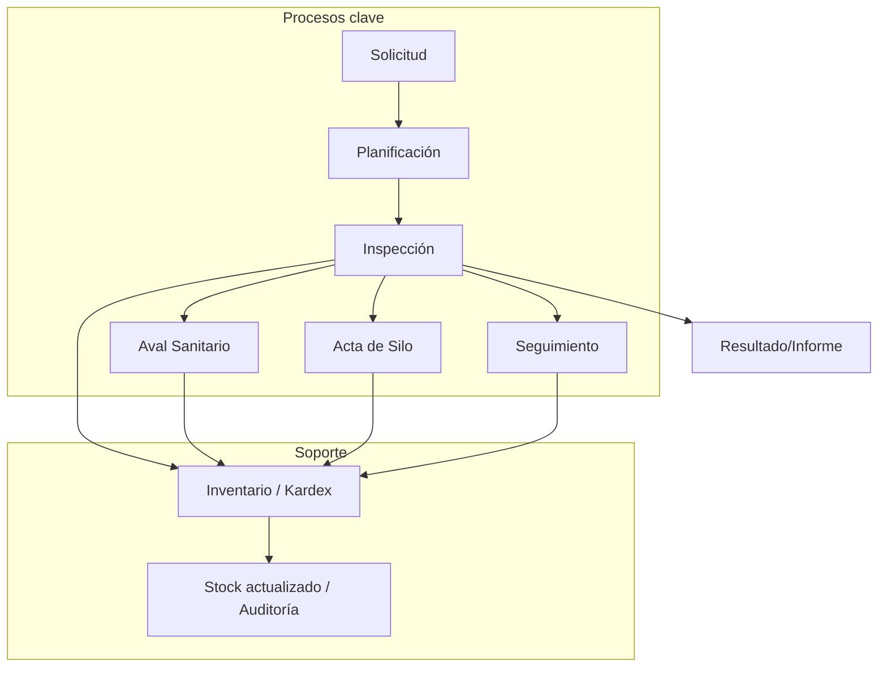

# Diagrama de Procesos SICIC-INSAI V2.0

## 1. Diagrama de flujo general

## 2. Cómo funciona cada proceso

### 2.1 Solicitud
- Entrada: datos del cliente/productor, tipo de trámite, propiedad, motivo de la inspección.
- Proceso: crear un registro inicial con estado `CREADA`, validar cliente y propiedad.
- Salida: solicitud registrada y lista para planificar.

### 2.2 Planificación
- Entrada: solicitud aprobada, fecha/hora propuesta, equipo técnico, vehículo, ubicación.
- Proceso: asignar recursos, definir objetivo y preparar el campo de inspección.
- Salida: planificación con estado `PENDIENTE` y solicitud actualizada a `PLANIFICADA`.

### 2.3 Inspección
- Entrada: planificación activa, datos de la inspección, hallazgos, fotos, consumo de insumos.
- Proceso: registrar el trabajo de campo, validar hallazgos, sincronizar estados.
- Salida: inspección creada, planificación y solicitud pasan a `INSPECCIONANDO`, reporte inicial.

### 2.4 Aval Sanitario
- Entrada: inspección animal que cumple criterios, datos técnicos de salud, vacunas, biológicos.
- Proceso: generar un aval sanitario basado en la inspección.
- Salida: aval emitido, registro de consumos y referencias a la inspección.

### 2.5 Acta de Silo
- Entrada: inspección de almacenamiento, datos de silos, capacidad, condiciones sanitarias.
- Proceso: crear acta de inspección de silos con hallazgos y fotos.
- Salida: acta de silo registrada, con referencia a la inspección y datos de seguimiento.

### 2.6 Seguimiento
- Entrada: inspección, aval o acta de silo con irregularidades o pendientes.
- Proceso: programar nueva visita, verificar cumplimiento de medidas y registrar nuevas observaciones.
- Salida: seguimiento registrado y cierre de ciclo si se cumplen las acciones.

## 3. Entradas y salidas por grupo de procesos

### 3.1 Proceso de entrada al ciclo
- Entradas principales: cliente, propiedad, solicitud de servicio, tipo de inspección.
- Resultado: solicitud creada y planificada.

### 3.2 Proceso de inspección y producción de resultados
- Entradas principales: datos de campo, plan de trabajo, hallazgos técnicos.
- Resultado: inspección documentada y generación de aval, acta o seguimiento.

### 3.3 Proceso de inventario
- Entradas: consumo de insumos desde inspección, aval, acta o seguimiento.
- Proceso: registrar movimientos en `movimientos_insumos`, validar stock y revertir si hace falta.
- Salida: stock actualizado, auditoría de consumo y trazabilidad total.

## 4. Rol del inventario (Kardex)
- Entrada: cualquier operación que utilice insumos para un proceso operativo.
- Proceso: descontar stock, validar niveles, registrar referencia a proceso.
- Salida: inventario actualizado, alertas de stock bajo y reversión automática si se elimina un proceso.

## 5. Estados claves del ciclo
- `CREADA` → solicitud inicial.
- `PLANIFICADA` → plan de trabajo listo.
- `PENDIENTE` → planificación o inspección en espera.
- `INSPECCIONANDO` → proceso en ejecución.
- `FINALIZADA` → inspección o trámite completado.
- `NO_APROBADA` / `SEGUIMIENTO` / `CUARENTENA` → resultados especiales que generan acciones adicionales.

## 6. Resumen visual simplificado
- Solicitud inicia el ciclo.
- Planificación organiza recursos.
- Inspección ejecuta la actividad técnica.
- Aval, acta o seguimiento nacen de la inspección.
- Inventario controla insumos en todos los procesos.
- El resultado final es una acción cerrada y auditada.
