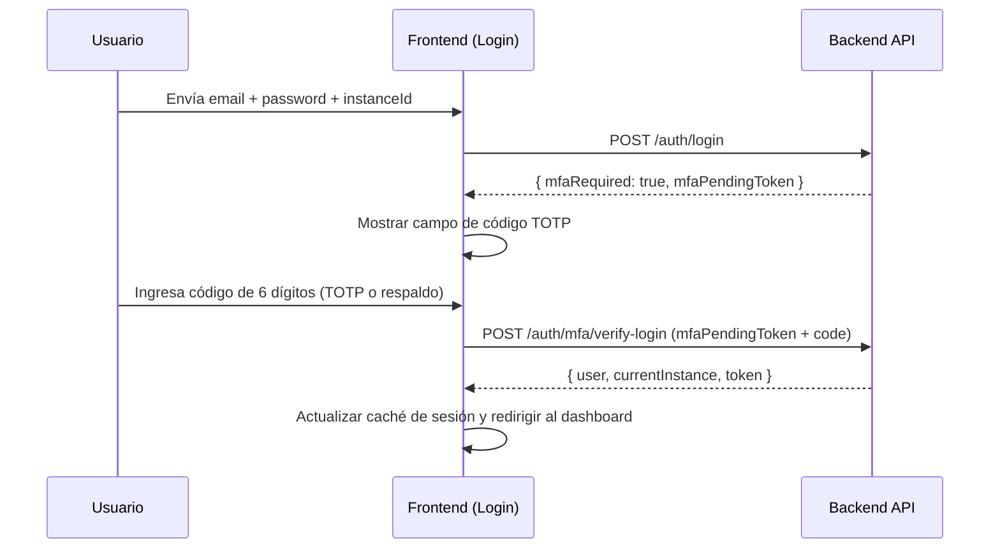

# Flujo de Autenticación MFA (2FA) — Frontend

Este documento describe el flujo completo de autenticación de dos factores desde la perspectiva del frontend, abarcando el paso adicional de verificación TOTP durante el login y los servicios de red involucrados.

---

## 1. Flujo de Login con MFA Activo

Cuando un usuario tiene MFA habilitado, el proceso de login estándar se extiende a dos pasos. La pantalla de login detecta este escenario a través de la respuesta del servidor.

### Paso 1: Login Estándar

El usuario envía sus credenciales (email, contraseña, instancia) a través de `authService.login()`. Si el servidor detecta `mfa_enabled = true`, retorna:

```json
{
  "status": "success",
  "data": {
    "mfaRequired": true,
    "mfaPendingToken": "eyJ..."
  }
}
```

El hook `useAuth` detecta `mfaRequired: true` y **no actualiza la caché de sesión**, manteniendo al usuario en un estado de "pre-autenticación".

### Paso 2: Verificación TOTP

El frontend muestra un campo para el código de 6 dígitos (o código de respaldo). El usuario introduce el código y se llama a:

```typescript
authService.verifyMfaLogin({ mfaPendingToken, code })
// POST /auth/mfa/verify-login
```

Si la verificación es exitosa, la respuesta incluye el **JWT de sesión completo** y los datos del usuario/instancia, completando el login normalmente.

---

## 2. Detección y Manejo en `useAuth`

El hook `useAuth` (`src/hooks/use-auth.ts`) maneja la lógica de bifurcación del login:

```typescript
const loginMutation = useMutation({
  mutationFn: authService.login,
  onSuccess: (response) => {
    if (!response.data?.mfaRequired) {
      // Login normal: actualizar caché inmediatamente
      queryClient.setQueryData(['auth-user'], response);
    }
    // Si mfaRequired: no actualizar. El componente de login maneja el paso 2.
  },
});
```

El componente de login inspecciona el retorno de `login()` para determinar si debe mostrar el campo de verificación TOTP o redirigir al dashboard.

---

## 3. Servicios de Red (`auth.service.ts`)

Todos los endpoints de MFA están mapeados en `authService`:

```typescript
// Verificación al hacer login (público con mfaPendingToken)
verifyMfaLogin: async (dto: { mfaPendingToken: string; code: string }) => ...

// Activación (privado, requiere JWT completo)
setupMfa: async () => ...          // Genera QR y secret
enableMfa: async (dto) => ...      // Confirma TOTP, activa MFA, retorna backupCodes

// Gestión (privado)
disableMfa: async (dto) => ...
regenerateBackupCodes: async (dto) => ...
```

---

## 4. Hook `useVerifyMfaLogin`

```typescript
// src/hooks/use-mfa.ts
export const useVerifyMfaLogin = () => {
  return useMutation({
    mutationFn: (dto: { mfaPendingToken: string; code: string }) =>
      authService.verifyMfaLogin(dto),
    onError: (error: any) => {
      const message = error?.response?.data?.message || 'Código MFA o de respaldo incorrecto';
      toast.error(message);
    },
  });
};
```

El hook acepta tanto un **código TOTP de 6 dígitos** como un **código de respaldo en formato `XXXX-XXXX`**. La verificación del tipo de código la realiza el backend automáticamente.

---

## 5. Diagrama del Flujo de Login con MFA



---

[Volver al índice de documentación](../WIKI.md)

**Flujo MFA en Login — Frontend SICIC-INSAI V2.0**
