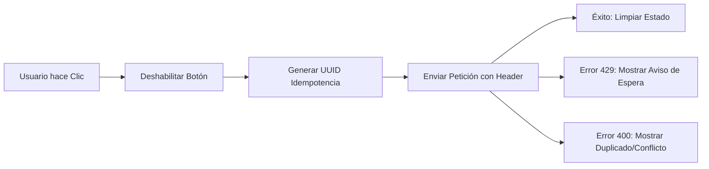

# Integración de Seguridad y Robustez en el Frontend

Este documento explica cómo el frontend interactúa con las medidas de seguridad del backend para garantizar una experiencia de usuario fluida y libre de duplicidad de datos.

---

## 1. Gestión Automática de Idempotencia

El cliente de API (`api-client.ts`) está configurado para manejar la idempotencia de forma transparente para el desarrollador.

### Funcionamiento del Interceptor
- Todas las peticiones de tipo **POST, PUT, PATCH y DELETE** son interceptadas.
- Si la petición no contiene manualmente un header `X-Idempotency-Key`, el interceptor genera un **UUID v4** único.
- Este mecanismo asegura que si el usuario hace "doble clic" rápidamente en un botón de guardado, o si la red falla y el cliente reintenta la petición, el backend reconocerá que es la misma operación.

### Ejemplo de Configuración
```typescript
// En src/lib/api-client.ts
apiClient.interceptors.request.use((config) => {
  if (['post', 'put', 'patch', 'delete'].includes(config.method?.toLowerCase())) {
    if (!config.headers['X-Idempotency-Key']) {
      config.headers['X-Idempotency-Key'] = crypto.randomUUID();
    }
  }
  return config;
});
```

---

## 2. Manejo de Rate Limiting (Error 429)

El frontend debe estar preparado para manejar el límite de tasa impuesto por el backend (50 escrituras cada 15 minutos).

- **Comportamiento:** Si el usuario excede el límite, el backend responderá con un `429 Too Many Requests`.
- **UI/UX:** El interceptor de respuesta captura este error y muestra una notificación estandarizada indicando al usuario que debe esperar antes de realizar más cambios.

---

## 3. Mejores Prácticas para el Desarrollador

Aunque el sistema es automático, se recomiendan las siguientes prácticas:

1.  **Bloqueo de UI:** Siempre deshabilitar los botones de "Guardar" o "Enviar" inmediatamente después del primer clic para evitar disparar múltiples peticiones (la idempotencia es la última línea de defensa, no la primera).
2.  **Manejo de Transacciones:** Si una operación de creación devuelve un error de conflicto (400), informar al usuario claramente que el código o registro ya existe, evitando confusiones.

---

## Diagrama de Interacción Frontend-API



---

**Arquitectura de Robustez Frontend**
**SICIC-INSAI V2.0**
