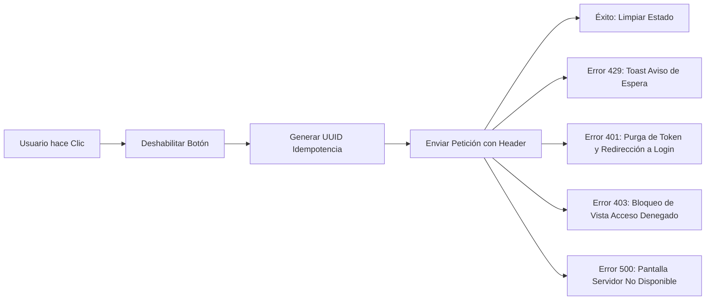

# Integración de Seguridad y Robustez en el Frontend

Este documento explica cómo el frontend interactúa con las medidas de seguridad del backend para garantizar una experiencia de usuario fluida y libre de duplicidad de datos.

---

## 1. Gestión Automática de Idempotencia

El cliente de API (`api-client.ts`) está configurado para manejar la idempotencia de forma transparente para el desarrollador.

### Funcionamiento del Interceptor
- Todas las peticiones de tipo **POST, PUT, PATCH y DELETE** son interceptadas.
- Si la petición no contiene manualmente un header `X-Idempotency-Key`, el interceptor genera un **UUID v4** único.
- Este mecanismo asegura que si el usuario hace "doble clic" rápidamente en un botón de guardado, o si la red falla y el cliente reintenta la petición, el backend reconocerá que es la misma operación.

### Ejemplo de Configuración
```typescript
// En src/lib/api-client.ts
apiClient.interceptors.request.use((config) => {
  if (['post', 'put', 'patch', 'delete'].includes(config.method?.toLowerCase())) {
    if (!config.headers['X-Idempotency-Key']) {
      config.headers['X-Idempotency-Key'] = crypto.randomUUID();
    }
  }
  return config;
});
```

---

## 2. Manejo de Rate Limiting (Error 429)

El frontend debe estar preparado para manejar el límite de tasa impuesto por el backend (50 escrituras cada 15 minutos).

- **Comportamiento:** Si el usuario excede el límite, el backend responderá con un `429 Too Many Requests`.
- **UI/UX:** El interceptor de respuesta captura este error y muestra una notificación estandarizada indicando al usuario que debe esperar antes de realizar más cambios.

---

## 3. Sistema de Pantallas de Error y Contramedidas de Seguridad (404, 403, 500)

Para garantizar un control perimetral absoluto y proteger la aplicación contra acceso no autorizado, manipulación maliciosa de URLs o fallos de infraestructura, la aplicación integra:

### A. Pantalla de Error 403 (Acceso Denegado / Sin Permisos)
- **Componente:** `src/pages/error/Error403.tsx`
- **Integración:** Integrado directamente en `<PermissionRoute />`. Si un usuario intenta escribir directamente la URL de un módulo para el cual su rol no tiene privilegios (ej. `/home/roles`), la interfaz le bloquea el paso mostrando la pantalla 403 de **Acceso Denegado** e impidiendo la carga o renderizado de datos.

### B. Pantalla de Error 500 (Servidor No Disponible)
- **Componente:** `src/pages/error/Error500.tsx` & `ErrorBoundary.tsx`
- **Integración:** Captura caídas de red, fallos graves del servidor (`500`, `502`, `503`) o excepciones no controladas en el árbol de renderizado de React. Incluye botón interactivo para reintentar la conexión al backend en tiempo real.

### D. Contramedida de Bloqueo Progresivo por Intentos Fallidos en Login (HTTP 423)
- **Persistencia:** Los campos `intentos_fallidos` y `bloqueado_hasta` en la base de datos máster rastrean los accesos no autorizados por usuario.
- **Nivel 1 (Cooldown de 5 min):** Tras acumular entre 3 y 5 fallos consecutivos, el servidor responde con un estado `423 Locked`. La interfaz de `Login.tsx` activa un **Temporizador de Cuenta Regresiva** en vivo deshabilitando el formulario durante 5 minutos.
- **Nivel 2 (Bloqueo Severo de 24h):** Al agotar los intentos extra (5+ acumulados), la cuenta entra en un estado de bloqueo por 24 horas.
- **Desbloqueo Inmediato:** El usuario puede omitir la espera utilizando la función **"Restablecer Contraseña"** por correo, la cual limpia los contadores de bloqueo al modificar exitosamente la clave.

---

## 4. Mejores Prácticas para el Desarrollador

Aunque el sistema es automático, se recomiendan las siguientes prácticas:

1.  **Bloqueo de UI:** Siempre deshabilitar los botones de "Guardar" o "Enviar" inmediatamente después del primer clic para evitar disparar múltiples peticiones (la idempotencia es la última línea de defensa, no la primera).
2.  **Manejo de Transacciones:** Si una operación de creación devuelve un error de conflicto (400), informar al usuario claramente que el código o registro ya existe, evitando confusiones.

---

## Diagrama de Interacción Frontend-API


```mermaid
graph LR
    Action[Usuario hace Clic] --> UI[Deshabilitar Botón]
    UI --> Interceptor[Generar UUID Idempotencia]
    Interceptor --> Fetch[Enviar Petición con Header]
    Fetch --> Success[Éxito: Limpiar Estado]
    Fetch --> Error429[Error 429: Toast Aviso de Espera]
    Fetch --> Error401[Error 401: Purga de Token y Redirección a Login]
    Fetch --> Error403[Error 403: Bloqueo de Vista Acceso Denegado]
    Fetch --> Error500[Error 500: Pantalla Servidor No Disponible]
```

---

**Arquitectura de Robustez Frontend**
**SICIC-INSAI V2.0**

