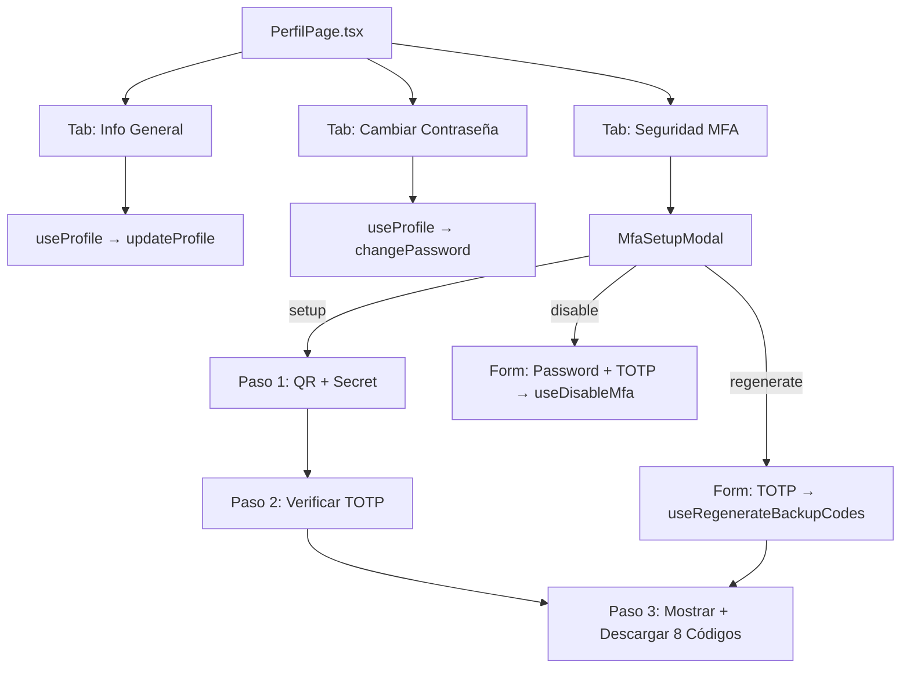

# Módulo de Perfil de Usuario — Frontend

Este documento describe la arquitectura, estructura de componentes y flujos de la página de gestión de perfil de usuario (`/perfil`) en el SICIC-INSAI V2.0, incluyendo la edición de datos, el cambio de contraseña y el módulo completo de MFA.

---

## 1. Estructura del Módulo

```
src/pages/perfil/
├── PerfilPage.tsx            # Página principal del perfil (3 pestañas)
└── components/
    └── MfaSetupModal.tsx     # Modal multi-funcional para gestión de MFA
```

---

## 2. Hooks de Datos (`use-profile.ts`)

El hook `useProfile` encapsula las mutaciones del perfil del usuario, aislando la lógica de red de los componentes visuales.

```typescript
// src/hooks/use-profile.ts
const { updateProfile, isUpdatingProfile, changePassword, isChangingPassword } = useProfile();
```

| Función | Método API | Descripción |
|---|---|---|
| `updateProfile(dto)` | `PUT /auth/profile` | Actualiza username y email. Invalida la caché `['auth-user']`. |
| `changePassword(dto)` | `POST /auth/change-password` | Cambia la contraseña del usuario autenticado. |

---

## 3. `PerfilPage.tsx` — Estructura de 3 Pestañas

La página se organiza en un layout de 2 columnas:
- **Columna izquierda**: Tarjeta de resumen de cuenta (ID, email, instancia, estado MFA).
- **Columna derecha**: Panel de tabs con las 3 secciones funcionales.

### Tab 1: Información General
Formulario controlado para editar `username` y `email`. Al enviar, llama a `updateProfile()`. Incluye validación de campos vacíos con feedback via `toast`.

### Tab 2: Cambiar Contraseña
Formulario con 3 campos de contraseña (actual, nueva, confirmación), cada uno con botón de visibilidad toggle (ojo). Implementa un **medidor de fortaleza de contraseña** en tiempo real.

#### Criterios del medidor de fortaleza

| Score | Etiqueta | Color |
|---|---|---|
| ≤ 2 | Débil | `bg-rose-500` |
| ≤ 4 | Media | `bg-amber-500` |
| 5 | Fuerte | `bg-emerald-500` |

Los criterios evaluados son: longitud ≥ 6, longitud ≥ 10, uso de mayúsculas, uso de números y uso de caracteres especiales.

### Tab 3: Seguridad MFA
Panel de estado del MFA con indicadores visuales (activo/inactivo) y botones de acción contextuales:
- **Si MFA inactivo**: Botón "Configurar Autenticación MFA (2FA)" → Abre `MfaSetupModal` en modo `setup`.
- **Si MFA activo**: Dos botones:
  - "Regenerar Códigos de Respaldo (8)" → Abre `MfaSetupModal` en modo `regenerate`.
  - "Desactivar MFA" → Abre `MfaSetupModal` en modo `disable`.

---

## 4. `MfaSetupModal.tsx` — Modal Multi-Funcional

Modal glassmorphism de fondo oscuro (`bg-slate-900/90 backdrop-blur-xl`) que soporta 3 modos de operación controlados por la prop `actionType`.

### Props del Componente

```typescript
interface MfaSetupModalProps {
  isOpen: boolean;
  isMfaEnabled: boolean;
  actionType?: 'setup' | 'disable' | 'regenerate';
  onClose: () => void;
}
```

### Modo `setup` (Activación en 3 Pasos)

| Paso | Descripción |
|---|---|
| **Paso 1** | Muestra el QR y el secreto en texto plano con botón de copiar. Al abrir el modal, llama automáticamente a `useSetupMfa()`. |
| **Paso 2** | Input para el código TOTP de 6 dígitos. Al confirmar, llama a `useEnableMfa()`. Si es válido, transiciona al Paso 3. |
| **Paso 3** | Muestra los 8 códigos de respaldo en una grilla. Ofrece botones de **Copiar** y **Descargar (.txt)**. |

### Modo `disable` (Desactivación)
Formulario de un solo paso. Requiere la contraseña actual del usuario y un código TOTP de 6 dígitos. Usa `useDisableMfa()`.

### Modo `regenerate` (Nuevos Códigos de Respaldo)
Formulario de un solo paso que pide el código TOTP actual. Al confirmar con `useRegenerateBackupCodes()`, transiciona al **Paso 3** (el mismo de mostrar/descargar los códigos nuevos).

### Descarga de Códigos de Respaldo
La función `downloadBackupCodes` genera un archivo `.txt` con el siguiente formato:
```
CÓDIGOS DE RESPALDO DE EMERGENCIA MFA - SICIC INSAI
Generado: [fecha y hora]

1. ABCD-1234
2. EFGH-5678
...
8. WXYZ-9012

* Guarde estos 8 códigos en un lugar seguro...
```
El archivo se descarga con nombre dinámico: `codigos-respaldo-mfa-insai-{timestamp}.txt`.

---

## 5. Hooks de MFA (`use-mfa.ts`)

```typescript
// src/hooks/use-mfa.ts
useSetupMfa()           // Genera QR y secreto
useEnableMfa()          // Activa MFA con primer TOTP
useDisableMfa()         // Desactiva MFA
useVerifyMfaLogin()     // Usado en la pantalla de login para el segundo factor
useRegenerateBackupCodes() // Regenera los 8 códigos de respaldo
```

Todos los hooks usan `useMutation` de TanStack Query con `toast.error` en el callback `onError` para notificaciones visuales automáticas.

---

## 6. Diagrama de Interacción del Módulo



---

[Volver al índice de documentación](../WIKI.md)

**Módulo de Perfil y MFA — Frontend SICIC-INSAI V2.0**
